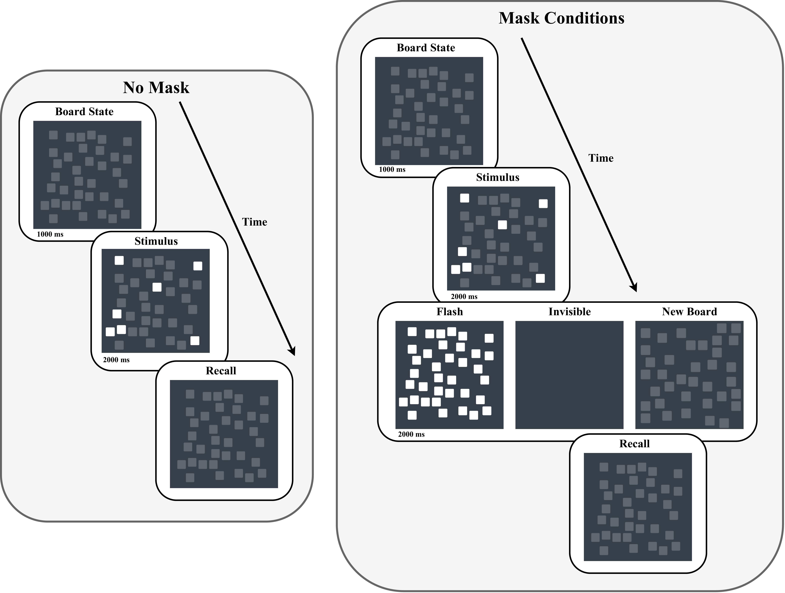

# Visual Projection Experiment Data

This repository is a WIP on open sourcing a dataset gathered from cognitive science research on visual projection. In the near future, this repository will include data from 40 participants solving this [modified visual paterns test](https://projection-experiment.vercel.app/).

## Table of Contents

- [Method](#method)
- [Results](#results)
- [Data](#data)
- [Citation](#citation)

### **Figure 1.** Modified visual patterns test timeline

> **Note:** Trial timeline illustrating the sequence of visual stimuli and masking conditions. Participants first view the initial Board State for 1000 ms, followed by the Stimulus for 2000 ms. Subsequently, either no mask is presented (as shown on the left side of the figure), allowing immediate Recall, or one of three distractor masking conditions (Flash, Invisible, or New Board) is presented for 2000 ms (as shown in the right figure). Finally, in the Recall stage subjects are asked to replicate the pattern shown during the Stimulus stage without making any mistakes.

## Method

### **Figure 2.** Task instructions and board state.

  
  

Subjects were presented with brief instructions on the task before starting, as shown in the left figure above. On the right, a single random board layout of the task is shown. These board layouts randomly change between each trial of the task. Subjects solve 30 trials of each masking condition (Flash, Invisible, New Board) and 30 trials of a no masking condition for a total of 120 trials. Each masking condition is visually depicted in [Figure 1](#figure-1-modified-visual-patterns-test-timeline).

## Results

### **Figure 3.** Three performance statistic bar charts showing mean pattern size across the four conditions 

> **Note:** The bar chart displays the mean pattern size across the four task conditions. We calculated three performance metrics including the max trial performance, last trial performance, and average trial performance across the last 20 trials. n.s. - not significant, * p-value < 0.05, ** p-value < 0.005, *** p-value < 0.0005. 

### **Table 1.** Mean performance and planned contrasts across mask conditions

| Mask Condition | MTP (Mean ± SE) | FTP (Mean ± SE) | ATP (Mean ± SE) | Contrast       | MTP (P-value) | FTP (P-value) | ATP (P-value) |
|---------------|----------------|----------------|----------------|---------------|--------------|--------------|--------------|
| None         | 5.15 (0.2)      | 3.75 (0.26)   | 3.9 (0.18)    | None vs Flash | 0.735        | 0.088        | 0.3351       |
| Flash        | 5.23 (0.24)     | 4.18 (0.27)   | 4.09 (0.23)   | Invis. vs NB  | **0.019**    | 0.314        | **0.015**    |
| Invisible    | 4.88 (0.22)     | 3.55 (0.23)   | 3.72 (0.21)   | N / F vs I / NB | **4e-4**   | **0.003**    | **4e-4**     |
| New Board    | 4.35 (0.21)     | 3.30 (0.20)   | 3.23 (0.19)   |               |              |              |              |

> **Note:** MTP, FTP, and ATP refer to maximum, final, and average trial performance, respectively. The two abbreviated contrasts refer to Invisible vs. New Board and None / Flash vs. Invisible / New Board. Significant p-values are presented in bold.

## Data

Data coming soon

## Citation

Publication in-review.
